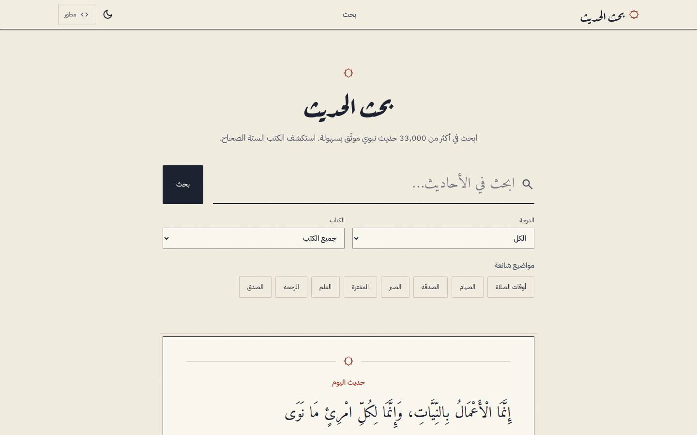
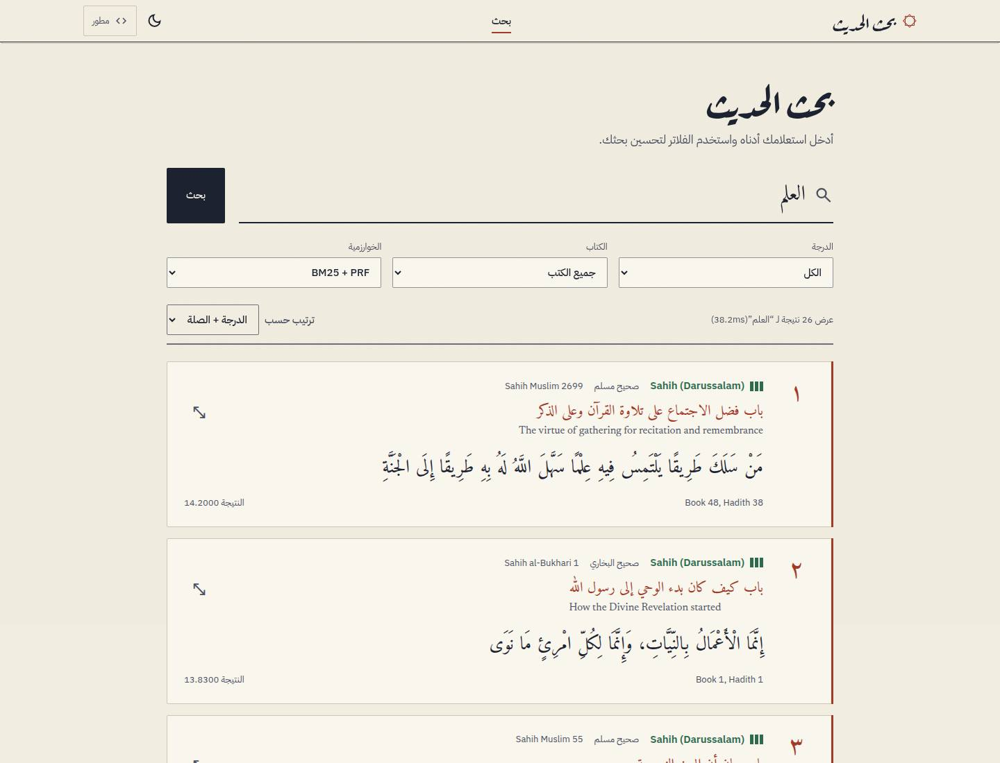
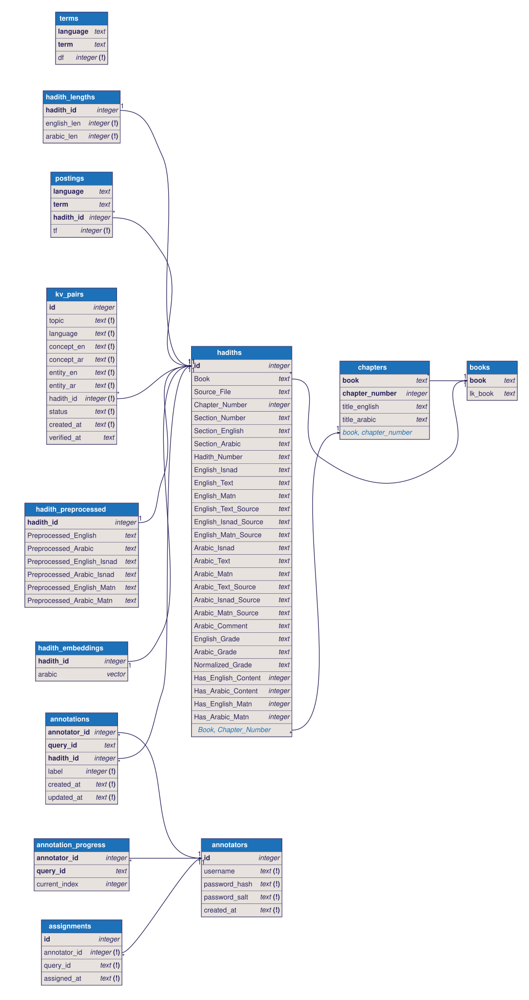
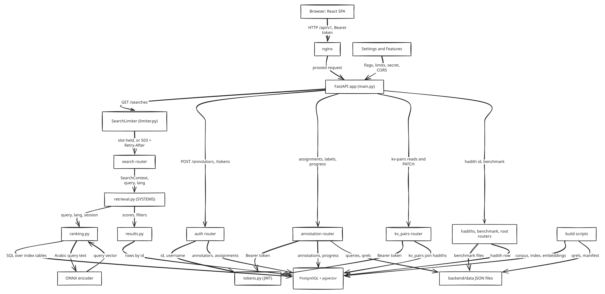

# Hadith Search Engine

A full-stack hadith search engine for English and Arabic queries, with eight ranking methods, a relevance-judgment platform for evaluating them, and a blue/green deployment with rollback.

**What is in it**

- Search: BM25, TF-IDF, term overlap, hybrid, pseudo-relevance feedback, rank fusion, and dense retrieval with a 64-dimension Arabic encoder served through ONNX Runtime and pgvector. All ranking runs as SQL on PostgreSQL.
- Evaluation: annotator accounts, candidate pooling, inter-annotator agreement, nDCG and recall reports.
- Engineering: a third-normal-form schema, REST errors as RFC 9457 problem details, queued load control, behaviour tests written in Gherkin, security tests, mutation testing, and an MLflow-driven model promotion.
- Delivery: GitHub Actions CI that prefers a self-hosted runner and falls back to GitHub-hosted ones, image scanning with trivy and dockle, and secret scanning on every commit.

Start with [Database design](#database-design), [Components and behaviours](#components-and-behaviours) and [Requirements traceability](#requirements-traceability).

## Prerequisites

- Python 3.10+
- Node.js 18+
- CUDA-capable GPU (recommended for embedding generation — CPU fallback available but very slow)

## Setup

```bash
# Backend
python -m venv venv
# On Windows: venv\Scripts\activate
# On Linux/Mac: source venv/bin/activate
cd backend
pip install -r ..\requirements.txt
mkdir data
```

### External Data Downloads

These must be run **after** `pip install`:

```bash
# NLTK data (tokenization, stopwords, lemmatization, POS tagging)
python -m nltk.downloader punkt_tab stopwords wordnet averaged_perceptron_tagger averaged_perceptron_tagger_eng

# CAMeL Tools data (calima-msa-r13 MLE disambiguator + morphology DB)
camel_data -i disambig-mle-calima-msa-r13
```

### Environment Variables

No API keys are needed for search or the build pipeline. Copy `.env.example` to `.env` and set `DATABASE_URL` (see the file for the other settings).

### Frontend

```bash
cd frontend
npm install
```

## Build Pipeline

Run all steps in sequence with a single command:

```bash
cd backend
python scripts\build_all.py
```

For local development without regenerating dense embeddings:

```bash
cd backend
python scripts\build_all.py --skip-embeddings
```

The script will:
1. Check if each step's output already exists and prompt you to overwrite, skip, or quit
2. Run each step with timing and error reporting
3. Stop on the first failure
4. Write `backend/data/build_manifest.json` with source, field, and artifact metadata

Use `--force` to rebuild existing outputs without prompts. By default the full pipeline includes dense embeddings and pooling. `--skip-embeddings` skips both embedding generation and pooling.

### Individual Steps

You can also run steps individually:

| Step | Command | Description | Output |
|------|---------|-------------|--------|
| 1 | `python scripts\data_creation.py` | Loads LK Hadith Corpus, applies deterministic reconstruction, and keeps the bilingual matn-complete corpus | `hadiths` table in PostgreSQL |
| 2 | `python scripts\profile.py` | Profiles the loaded corpus without modifying it | Console report |
| 3 | `python scripts\preprocess.py` | Tokenizes, lemmatizes, and removes stopwords for full text, isnad, and matn | Writes the six `Preprocessed_*` columns to the `hadith_preprocessed` table |
| 4 | `python scripts\build_inverted_index.py` | Builds the BM25 index over matn only | `terms`, `postings` and `hadith_lengths` tables |
| 5 | `python scripts\build_embeddings.py` | Generates Arabic dense embeddings with the ONNX encoder over the matn only (first run `python -m scripts.export_onnx` once to create the model) | `hadith_embeddings` table (float32 vectors) |
| 6 | `python scripts\pooling.py` | Pools candidate documents for relevance judgment | `qrels_ungraded.json` |

> **Note:** Step 5 requires significant VRAM (~12GB recommended). If you don't have a GPU, the script will prompt you before falling back to CPU (extremely slow).

### Download Pre-built Embeddings

If you want to skip the embedding generation step, download the pre-built files from [this link](PLACEHOLDER_URL) and extract them into `backend/data/`.

## Running the Project

### Backend

```bash
cd backend
uvicorn main:app --reload --port 8000
```

### Frontend

```bash
cd frontend
npm run dev
```

The frontend runs at `http://localhost:5173` by default.

## Design

The interface follows one idea: a page from a manuscript. Paper background, one red ink for emphasis, full Arabic text with room for diacritics, and a three-bar mark for the grade. It works from 360 px phones to wide screens, in light and dark.





Design language, palette, type, accessibility results and what was left out: [docs/design/README.md](docs/design/README.md).

## Project Structure

```
hadith-search/
├── backend/
│   ├── data/                 # Raw LK cache, DB, embeddings, indices, qrels, manifest
│   ├── routers/              # FastAPI endpoints
│   ├── scripts/              # Data processing & indexing scripts
│   │   ├── build_all.py          # Combined build orchestrator
│   │   ├── data_creation.py      # Load LK corpus & create bilingual matn DB
│   │   ├── profile.py            # Corpus profiling report
│   │   ├── preprocess.py         # Full text/isnad/matn preprocessing
│   │   ├── build_inverted_index.py  # BM25 inverted index builder
│   │   ├── build_embeddings.py   # Dense embedding generator
│   │   ├── search.py             # Search algorithms
│   │   ├── loading.py            # Data loading utilities
│   │   ├── pooling.py            # Relevance judgment pooling
│   │   ├── evaluation.py         # IR evaluation metrics
│   │   └── ...
│   └── main.py               # FastAPI application
├── frontend/
│   ├── src/
│   │   ├── components/       # React components
│   │   ├── pages/            # Page components
│   │   ├── api/              # API client
│   │   └── i18n/             # Internationalization
│   └── package.json
├── requirements.txt
└── README.md
```

## Available Scripts

### Data Processing
- `build_all.py` - Run the full build pipeline (recommended)
- `build_embeddings.py` - Generate dense embeddings (requires CUDA, with CPU fallback prompt)
- `build_inverted_index.py` - Build the BM25 index in PostgreSQL
- `data_creation.py` - Load LK Hadith Corpus into PostgreSQL
- `profile.py` - Profile the loaded corpus without mutating it
- `preprocess.py` - Preprocess hadith text
- `pooling.py` - Pool candidate documents for relevance judgment
- `evaluation.py` - Compute IR evaluation metrics

## Retrieval Architecture

| Algorithm | Description |
|-----------|-------------|
| **Term Overlap** | Exact matches ranked by term frequency |
| **TF-IDF** | Classic term frequency-inverse document frequency ranking |
| **BM25** | Okapi BM25 with optimized k1 and b parameters |
| **BM25 + TF-IDF (Hybrid)** | Combines BM25 and TF-IDF scores with weighted fusion |
| **BM25 + PRF** | BM25 with pseudo-relevance feedback (query expansion) |
| **Cosine Similarity** | Dense retrieval using vector embeddings and cosine similarity |
| **Semantic Rerank** | BM25 candidates reranked by cosine similarity |
| **Semantic RRF** | Reciprocal Rank Fusion combining sparse (BM25) and dense (cosine) results |
| **Exact words** | The query words as typed (no stemming), all of them must appear as whole words; ranked by how often they occur |
| **Exact + semantic RRF** | Reciprocal Rank Fusion of the exact-words ranking and the dense (cosine) ranking. Arabic only |

### Exact words, suggestions and "did you mean"

- `exact` matches the words you typed, lowercased and with Arabic marks and tatweel removed, but without stemming. Every word must appear as a whole word in the hadith (isnad and matn, as stored). Results are ranked by the number of occurrences, then by id, and capped at 500. The text it searches lives in the table `hadith_exact_text`, which `build_inverted_index` rebuilds. On an existing database run `tools/migrate_trgm.sh --dry-run`, then the same command without the flag (see `docs/HANDOFF.md` item 43).
- `GET /api/v1/suggestions?q=...&limit=...` returns up to 10 completions from the index vocabulary and chapter titles, using prefix and trigram (`pg_trgm`) matching.
- When `exact` or `bm25` finds nothing, the search answer can carry `did_you_mean`: the query with each unknown word replaced by the closest indexed term (similarity 0.4 or more). The field is absent otherwise.

### Search Architecture
- **Sparse Retrieval**: BM25, TF-IDF, Term Overlap — Fast, interpretable, language-independent
- **Dense Retrieval**: Cosine similarity over Arabic embeddings from `masterofaudio2077/Fada_ar_embedding` (ONNX, 64 dimensions). Arabic queries only
- **Fusion**: Reciprocal Rank Fusion (RRF) for combining multiple retrieval methods

## Database design

The schema is in third normal form: `books`, `chapters`, `hadiths`, `hadith_preprocessed`, `hadith_embeddings`, `hadith_lengths`, `terms`, `postings`, `annotators`, `assignments`, `annotations`, `annotation_progress` and `kv_pairs`. The `Section_*` columns stay on `hadiths` on purpose (see the note in the diagram). The source is [`docs/diagrams/schema.dbml`](docs/diagrams/schema.dbml), written from `backend/models/orm.py`.



To redraw it: `tools/diagrams/render.sh schema`.

## Components and behaviours

A request goes browser, nginx, the FastAPI app, the search limiter (search only), a router, then services, and from there to PostgreSQL or the ONNX encoder. Each arrow in the picture says what is passed.



- Sources: [Mermaid](docs/diagrams/components.mmd) and the [Excalidraw scene](docs/diagrams/components.excalidraw) (open it at excalidraw.com to edit).
- Behaviour as Gherkin, written from the code and tests and run by pytest-bdd: [search](docs/behaviours/search.feature), [spike queue](docs/behaviours/spike-queue.feature), [sign-in and tokens](docs/behaviours/auth.feature), [annotation](docs/behaviours/annotation.feature), [kv-pairs](docs/behaviours/kv-pairs.feature), [friendly errors](docs/behaviours/friendly-errors.feature), [production mode](docs/behaviours/prod-mode.feature).
- To redraw: `CHROME=/path/to/chromium tools/diagrams/render.sh components`.
- Running the behaviour tests: `pytest tests/bdd` (needs the test PostgreSQL; scenarios tagged `@nginx` or `@manual` are skipped).

## Requirements traceability

Each requirement is linked to the code that implements it and the tests that cover it in [`docs/TRACEABILITY.md`](docs/TRACEABILITY.md). That file also lists the requirements with no test, the tests that map to no requirement, and the open questions. This table is its summary; if the two differ, the file is right.

| Id | Requirement | Status |
| --- | --- | --- |
| R-01 | Eight search methods exist and return results | Covered |
| R-02 | SQL ranking matches the old in-memory scores | Covered |
| R-03 | Dense methods are Arabic only; English gets 422 | Covered |
| R-04 | Same query gives the same order (ties by id) | Covered |
| R-05 | Search takes filters and returns hadiths in rank order | Covered |
| R-06 | REST resources live under `/api/v1` with the right verbs and codes | Covered |
| R-07 | Errors are `application/problem+json` | Covered |
| R-08 | Cacheable reads carry `Cache-Control`, `ETag`, 304, `_links` | Covered |
| R-09 | `GET /api/v1/search-methods` lists enabled methods and languages | Covered |
| R-10 | JWT auth: signed, expiring, HS256 pinned | Covered |
| R-11 | Password rules and hashing | Covered |
| R-12 | Sign-in does not reveal which usernames exist | Covered |
| R-13 | Annotator sign-up and query assignment | Covered |
| R-14 | Labels and progress: scoped, idempotent, validated | Covered |
| R-15 | Inter-annotator agreement | Covered |
| R-16 | Benchmark endpoints | Covered |
| R-17 | KV pairs: login required, list, filter, statistics, verify | Covered |
| R-18 | KV pair shows the hadith text through `hadith_id` | Covered |
| R-19 | Settings class reads the environment once | Covered |
| R-20 | `APP_ENV` dev, test, prod behaviour | Covered |
| R-21 | Feature flags and `APP_MODE` presets decide what runs | Covered |
| R-22 | DB lifespan: create schema, explain failure, always dispose | Covered |
| R-23 | Users never see status codes or technical error text | Partly covered (status-to-message map only) |
| R-24 | Search queue in the app (`SearchLimiter`) | Covered |
| R-25 | nginx smoothing for search and the sign-in limit | Partly covered (script, not pytest) |
| R-26 | Foreign keys enforced; corpus rebuild is one transaction | Covered |
| R-27 | Schema is in third normal form | Covered |
| R-28 | Schema changes are additive (blue and green share a DB) | Covered |
| R-29 | The DB layer uses the ORM only, no raw SQL | Covered |
| R-30 | Each test runs in its own database schema | Covered |
| R-31 | Blue/green and canary releases | Covered |
| R-32 | Image, Dockerfile and secret scanning | Not covered by tests |
| R-33 | Security hardening (headers, path traversal, CORS, input limits) | Covered |
| R-34 | Corpus build: reconstruction, bilingual drop, grade normalisation | Covered |
| R-35 | Preprocessing and the second-stage drop | Covered |
| R-36 | Index and embeddings use matn only | Covered |
| R-37 | Arabic ONNX encoder, loaded once, one thread by default | Covered |
| R-38 | Build pipeline orchestrator | Covered |
| R-39 | One-time copy from the old SQLite install | Covered |
| R-40 | Evaluation metrics and statistics | Covered |
| R-41 | Recall proxy for the semantic methods | Covered |
| R-42 | Package-level lazy exports | Covered |
| R-43 | Frontend picker lists only methods the server offers | Not covered |
| R-44 | Load-test performance figures | Not covered |
| R-45 | The app serves the built frontend with a fallback route | Covered |
| R-46 | Blue/green rollback: automatic after a failed promote, manual, dry run | Partly covered (script, not pytest) |
| R-47 | Security suite: tokens, IDOR, sign-up and sign-in input, injection | Covered (`tests/security`; open findings are strict xfail) |
| R-48 | Security suite: input validation, error hygiene, prod docs hidden | Covered (`tests/security`; findings are strict xfail) |
| R-49 | Security suite: headers, CORS, nginx config, settings, abuse, secrets | Covered (`tests/security`; gaps are strict xfail) |
| R-50 | Health route: `GET /api/v1/health` checks the process and the database | Covered |
| R-51 | Image pruning keeps the newest 3 release images and the ones in use | Covered (fake docker; real run by hand) |
| R-52 | `tools/dead-code.sh` finds dead code with the repo's vulture config and never writes into the repo | Covered (`tools/test-dead-code.sh`, by hand) |
| R-53 | Model promotion picks the best MLflow version by nDCG@10 on logged pairs, gated by a margin over the live model and an ONNX parity check | Covered |
| R-54 | Embeddings can live in a per-release table; a colour with a missing or incomplete release refuses to start; the default table is untouched | Covered |
| R-55 | Promotion is staged, resumable and dry-runnable; only `--promote` releases it; `prune` keeps the newest 3 releases | Covered (`tools/promote_model.sh` itself and a real deploy by hand) |
| R-56 | CI uses the self-hosted runner only for trusted events when it is online and idle, otherwise GitHub-hosted | Partly covered (selector tested; workflow never ran on GitHub) |

Counts: 56 requirements, 49 fully covered, 4 partly covered (R-23, R-25, R-46, R-56), 3 with no automated test (R-32, R-43, R-44). See "Requirements with no test".

## Tech Stack

- **Backend**: FastAPI, PostgreSQL + pgvector, NLTK, CAMeL Tools, ONNX Runtime
- **Frontend**: React, TypeScript, Tailwind CSS, Vite
- **Retrieval**: BM25, BM25+PRF, Dense retrieval (Arabic only), Hybrid

## CI and security

CI (`.github/workflows/ci.yml`) runs lint, frontend, tests with a pgvector service, and an image scan. A small job on a GitHub-hosted runner (`tools/pick-runner.sh`) chooses where the rest runs. The self-hosted runner (`tools/runner/`) is used only for pushes, scheduled runs, manual runs and pull requests from this repository, and only when it is online and idle. Pull requests from forks always run on GitHub-hosted runners, because a privileged Docker daemon sits behind the self-hosted one.

Repository hygiene:

- Secrets live only in git-ignored `.env` files and GitHub secrets. `.env.example` holds placeholders. gitleaks runs as a pre-commit hook, and GitHub secret scanning with push protection is on.
- Workflow actions are pinned to commit SHAs, the workflow token is read-only, and the runner is ephemeral: it takes one job, then registers again clean.
- Production refuses to start without a 32-character `AUTH_SECRET` and an explicit `CORS_ORIGINS` (a `*` is refused).
- `tests/security` checks authentication, injection, input validation, headers and secret handling against the real app.

## Deploying

Releases run blue/green behind nginx on one host, with optional canaries by client address.
Set `POSTGRES_PASSWORD`, `AUTH_SECRET` (32+ characters) and `CORS_ORIGINS` (the site origin, not `*`) in `.env`. The compose file starts the app with `APP_ENV=prod`. Then:

```bash
tools/deploy.sh init              # first time: postgres, nginx, blue
tools/deploy.sh deploy --build    # new version on the idle colour
tools/deploy.sh canary 10         # 10% of client addresses
tools/deploy.sh promote           # or: tools/deploy.sh rollback
```

**Rollback.** `tools/deploy.sh promote` checks the new colour after the switch and puts traffic back on the old one by itself (exit 1) if it fails. `tools/deploy.sh rollback` does the same by hand, and refuses if the old colour is not running and healthy; add `--dry-run` to any command to see the plan. Images are tagged with the git sha and kept; `tools/deploy.sh prune-images` removes all but the newest 3 (never one that is running or still a rollback target). The health check is `GET /api/v1/health`, which also checks the database. The database is not rolled back: once the column drops of `docs/HANDOFF.md` item 28 (step 2/2b) have run, restore the `pg_dump` first, and create `deploy/state/schema-step2-applied` so rollback warns you. See item 35.

Both colours share one database, so schema changes must be additive. Details are in `docs/HANDOFF.md`, item 21.

## Model promotion

`tools/promote_model.sh` picks the best model version in an MLflow registry, exports it to ONNX, re-embeds the corpus into a new table and releases it through the blue/green deploy. It needs `uv pip install -r requirements.txt -r requirements-mlops.txt`, `MLFLOW_TRACKING_URI` (and `MLFLOW_TRACKING_TOKEN` if the server wants one) and `DATABASE_URL`. Put `MLFLOW_TRACKING_URI` (and, for DagsHub, `MLFLOW_TRACKING_USERNAME` and `MLFLOW_TRACKING_PASSWORD`, the access token) in your git-ignored `.env`; see `.env.example`. The script reads only the `MLFLOW_*` lines of that file, and a variable already set in the shell wins.

```bash
tools/promote_model.sh run --registered-model NAME --dry-run   # the pick, scores and plan; changes nothing
tools/promote_model.sh run --registered-model NAME             # export, check, re-embed, stage; production unchanged
tools/promote_model.sh run --registered-model NAME --promote   # also deploy the new colour and promote it
tools/promote_model.sh prune                                   # keep the newest 3 releases
```

Versions are scored by nDCG@10 of the 64-d cosine ranking on a labelled pairs file (`eval/pairs.json`, a JSON list of `{"query", "text", "label"}`) logged with each version's run. The best one must beat the live model by 0.01 and its ONNX export must match the original. See `docs/HANDOFF.md`, item 40.

## Business requirements

What the system has to do, in plain terms, and the rule in the code behind each point.

### Users

- **Searchers** look up hadiths in English or Arabic. They need no account.
- **Annotators** are signed-in volunteers who judge how relevant retrieved hadiths are to a set of test queries, and who verify generated concept-entity pairs.
- **Evaluators** are the people running the build and evaluation scripts. They use the annotators' judgments, the agreement figures and the benchmark results to compare retrieval systems. There is no evaluator role in the API: the agreement and benchmark endpoints are not restricted by role (agreement needs a token, benchmark does not).

### Search

- A searcher sends a query (1 to 500 characters), a method, a language (`en` or `ar`) and optionally a book filter and a grade filter. The answer is a ranked list of hadiths with their score.
- Ten methods exist: term overlap, TF-IDF, BM25, BM25 + TF-IDF hybrid, BM25 + pseudo-relevance feedback, cosine similarity, semantic rerank, semantic RRF, exact words and exact + semantic RRF. `GET /api/v1/search-methods` lists the ones enabled, with the languages each accepts.
- Sparse methods and `exact` work in both languages. Dense methods (cosine, semantic rerank, semantic RRF, exact + semantic RRF) work on Arabic only, because the embedding model is Arabic. An English query to a dense method, or an unknown method, is rejected with 422.
- Queries are preprocessed the same way as the corpus (NLTK for English, CAMeL Tools for Arabic), so terms match the index.
- Each hadith has an English and an Arabic text. The BM25 index and the embeddings cover the matn (the body of the hadith) only, not the chain of narrators.
- Which methods are available is a deployment choice (feature flags, or the `APP_MODE` presets `annotation`, `search`, `research`). The `annotation` preset runs without the search stack.
- Search results are cacheable for 5 minutes; they only change when the index is rebuilt.

### Annotation and agreement

- Each query in the benchmark has a fixed pool of candidate hadiths, built by running all retrieval systems and taking the union of their top results (`qrels_ungraded.json`).
- On sign-up an annotator is assigned 2 queries. A query can have at most 3 annotators. Assignment picks the queries with the fewest annotators first, and a lock makes sure two simultaneous sign-ups cannot push a query past 3. If fewer than 2 queries have a free place, the annotator gets fewer.
- An annotator can only see and label queries assigned to them, and only hadiths in that query's pool. Anything else returns 404.
- A label is 0, 1 or 2. One annotator has one label per hadith per query. Sending a label again replaces the old one (201 on first save, 200 on replacement), so retries are safe.
- Each annotator's position in a query is saved, so they can resume where they stopped. The saved position must fall inside the pool.
- Agreement is computed per query, over the hadiths that every assigned annotator labelled. It reports Cohen's kappa, Spearman correlation (both averaged over annotator pairs) and the share of hadiths with identical labels. A query needs at least 2 annotators and at least 2 commonly labelled hadiths, otherwise its figures are empty. The overall summary averages kappa and Spearman across the queries that have them.

### Accounts and auth

- Annotators sign up with a username (3 to 64 characters, unique) and a password (8 to 128 characters). Sign-up returns a token and the assigned queries; sign-in with `POST /api/v1/tokens` does the same.
- Passwords are stored as salted PBKDF2-SHA256 hashes. An unknown username takes as long to reject as a wrong password, so response time does not reveal which usernames exist.
- Tokens are signed JWTs (HS256) that expire after 12 hours by default. There is no server-side session, so a token cannot be revoked before it expires. In production `AUTH_SECRET` (32+ characters, the same on every server) and `CORS_ORIGINS` (not `*`) are required, and the API docs are hidden.
- An annotator can read only their own profile (403 otherwise). Search, search methods, single hadiths and benchmark results are public.

### KV pairs

- KV pairs are generated concept-entity pairs (English and Arabic) on ten topics such as prayer, fasting, charity and seeking knowledge, each linked to a hadith.
- Annotators review them: list by status or topic (up to 200 per page), see counts by status and topic, and mark a pair `verified` or `rejected`, singly or in a batch. A new pair is `pending`. The time of each decision is stored. Batches skip ids that do not exist. All kv-pairs routes require a token.

### Benchmark

- The benchmark endpoints publish stored evaluation output: per-system results, statistical tests, fine-tuned model results and the comparison across systems. Each returns 404 with a hint to run the matching script if that evaluation has not been run. Results are cacheable for 5 minutes.
- The evaluation uses a stratified sample of 2000 hadiths, so systems are compared on the same set.

### Load control

- Search is the costly operation (encoding and ranking use CPU), so it is queued. Up to 8 searches run at once. Up to 64 more wait, for at most 5 seconds each, in arrival order. Beyond that, or after the wait, the answer is 503 with `Retry-After`, and the frontend shows an Arabic "server busy" message. The limits are `SEARCH_MAX_CONCURRENT`, `SEARCH_QUEUE_SIZE` and `SEARCH_QUEUE_TIMEOUT_SECONDS`.
- nginx limits each client address on search (about 10 requests per second, a burst of 20, at most 8 open connections, 503 beyond that).
- nginx also limits sign-in and sign-up per client address: 5 attempts at once, then 1 per minute, 429 with `Retry-After`. This protects against password guessing and the cost of password hashing.
- These limits live in nginx and the search queue. Running uvicorn alone has no per-address limit.

### Deployment

- The app runs behind nginx with PostgreSQL (pgvector); only nginx is published, on port 8000. The container runs as a non-root user.
- Releases are blue/green. A new version starts on the idle colour, can receive a percentage of traffic chosen by client-address hash (a canary), and is then promoted or rolled back. Responses carry `X-Release` to show which colour answered.
- Both colours share one database, so schema changes must be additive: the old release must keep working on the new schema.
- Errors are returned as RFC 9457 problem+json.
