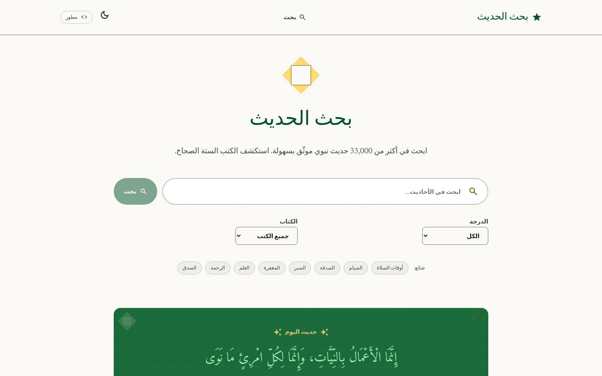
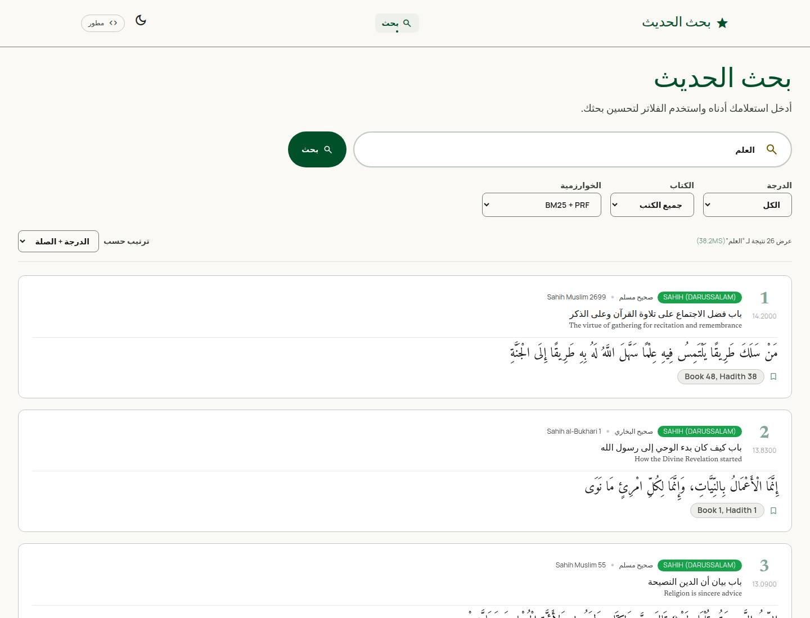
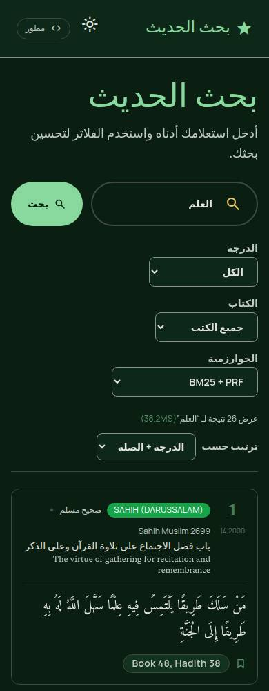
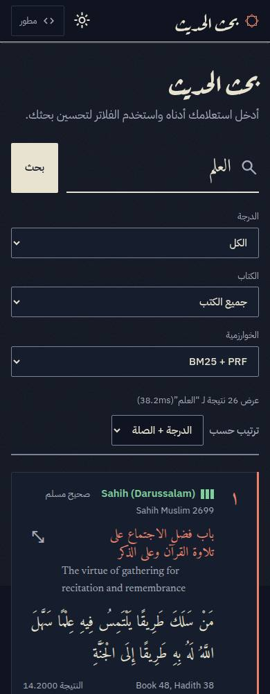
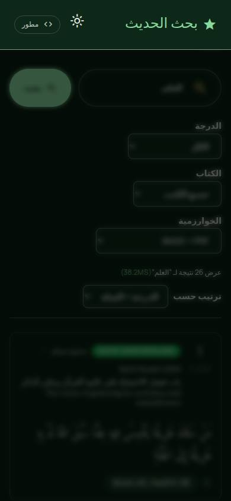
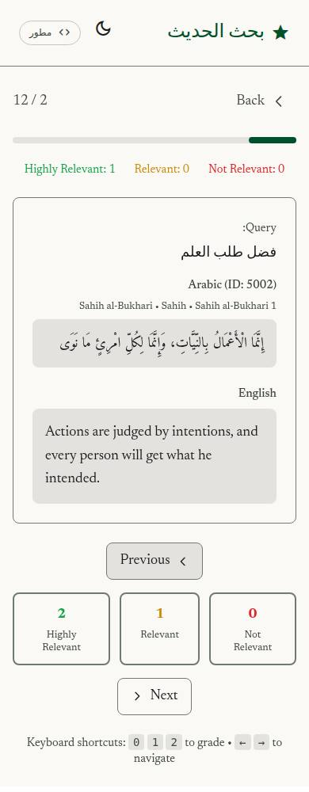
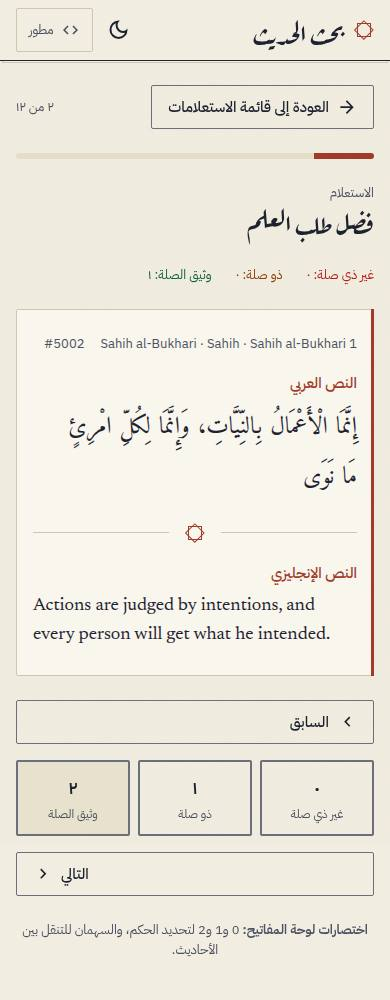

# Design: Warāqa

The interface is designed like a page from a manuscript. Paper-coloured background, one red ink (rubric) for emphasis, text in full and never cut. Search results read like folios, not like cards in a feed.

Screenshots in this folder are JPEGs cut from full-page captures made with Playwright and Chromium against a stub API (no backend was running). File names are `before-` or `after-`, the page, the theme and the viewport width.

| Page | Before | After |
|---|---|---|
| Home, light, 1440 px |  |  |
| Results, light, 1440 px |  |  |
| Results, dark, 390 px |  |  |
| Hadith dialog, dark, 390 px |  |  |
| Annotation, light, 390 px |  |  |

The mockup the results page was built from is `mockup-search.jpg`.

## Design language

- **Paper and ink.** Warm paper (`#f1ede0`) in light mode, night-reading ink blue (`#0f1420`) in dark mode. Text is near-black ink. The only accent is rubric red (`#a23a2a`, `#e8836c` in dark), used for chapter titles, the rank number, the margin rule on a result and the focus line of the search field.
- **Folio cards.** A result has a rubric rule on its inline-start edge that thickens on hover or focus, the rank in Arabic-Indic digits in the margin, and the chapter title in rubric. The Arabic text is large, with a line height of about 2 so the diacritics have room.
- **Grade glyph.** Grade is shown as three small bars (3 filled for Sahih, 2 for Hasan, 1 for Da'if, none for fabricated or unknown) next to the grade text exactly as the source gives it. Colour is never the only signal: the bars, the text and a hidden screen-reader label all say the same thing.
- **Double rule and khatam.** The header ends in a double rule. A small eight-point star (two squares, one turned 45 degrees) marks the home page, empty results and section breaks. It is drawn in CSS, with no image.
- **Grain.** A very faint paper texture sits on one fixed layer. It is never attached to scrolling content.

## Palette tokens

Same token names as before (`primary`, `surface`, `dark-*`, and so on) so pages that were not rewritten changed with them. New tokens: `grade-sahih`, `grade-hasan`, `grade-daif`, `grade-fabricated`, `grade-unknown` and their `dark-` pairs.

| Role | Light | Dark |
|---|---|---|
| Background / surface | `#f1ede0` | `#0f1420` |
| Ink (primary text) | `#1d2230` | `#e8e2d0` |
| Rubric (secondary) | `#a23a2a` | `#e8836c` |
| Sahih | `#2d6a4f` | `#7fcf9f` |
| Hasan | `#2f5d8c` | `#8fb6e8` |
| Da'if | `#8a5a00` | `#e0b25a` |
| Unknown | `#5f6270` | `#a9adbb` |

## Type

- Aref Ruqaa for display headings only (the logo and page titles).
- Amiri for Arabic hadith text and chapter titles.
- IBM Plex Sans Arabic for the interface.
- Newsreader for the English text. English is always `dir="ltr"` with `lang="en"`, Arabic is `lang="ar"`.
- Fonts come from Google Fonts through a `<link>`, which the existing CSP already allows. They use `display=swap`.

## Motion

- Results rise in with a short stagger (55 ms steps, capped at 8), page content fades up once.
- The search field underline fills with ink when focused. The dialog scales in, and on phones it is a bottom sheet.
- `prefers-reduced-motion` turns all of it off, including the loading star.
- Only `transform` and `opacity` are animated.

## Components

New: `GradeSeal`, `FilterSelect` (one labelled select used by the grade, book and algorithm filters). Rewritten: `Navbar` (skip link target, current page marked), `ThemeToggle`, `Footer`, `SearchBar`, `HadithCard`, `HadithModal`, `HadithOfTheDay`, `Pagination`, `ErrorBanner`, `LoadingSpinner`, the home pages, both search pages and the annotation session page. `Layout` has a skip link and a `#content` target.

## Ideas that are specific to this subject

1. **Reading order follows a book.** Rank, grade and source above, chapter, then the text, then the score and the in-book reference. Nothing in the text is truncated, reordered or restyled by grade.
2. **Grade as a ladder of bars** rather than coloured pills. A "weak" hadith is not shouted in red, and a reader who cannot tell greens from reds still sees the number of bars.
3. **Hadith of the day as a framed page** with a double border, centred, Arabic first.
4. **A quiet empty state.** No sad icon: the star, the message and a hint to use fewer words.
5. **Dialog copy button** copies Arabic, English and the reference together.

## Vercel Web Interface Guidelines: what was applied

The current text was fetched and every page checked against it.

- Every form control has a label tied to it (`htmlFor` and `id`), including the sort and compare selects that had none.
- Icon-only buttons have `aria-label`; decorative icons have `aria-hidden`.
- Focus is always visible (`focus-visible` rings and lines), never removed without a replacement.
- Touch targets are at least 44 px (`.tap`).
- The dialog has `role="dialog"`, `aria-modal`, a label, a focus trap, Escape to close, and puts focus back on the button that opened it. It is rendered on `<body>` through a portal.
- Results are a list, pagination is a `nav` with `aria-current="page"`, the progress bar in annotation is a `progressbar`.
- Live regions (`role="status"`, `role="alert"`) for loading, saving, copy and errors.
- Numbers use `tabular-nums`; Arabic numerals via `Intl.NumberFormat('ar-EG')`.
- `100dvh` instead of `100vh`, `overscroll-behavior: contain` in the dialog, `color-scheme` set for both themes, `<meta name="theme-color">`, `translate="no"` on references and grade names.
- Scrollable tables are keyboard focusable.
- Reduced motion respected. No animation of layout properties.

## What taste-skill and image-to-code contributed

- **Taste skill** (project scope, in `.claude/skills/`): the rule to commit to one clear visual idea and avoid default AI looks (purple gradients, glass cards, a generic font stack); asymmetry and generous whitespace; a single accent; the paper grain only on a fixed layer; no animation of layout properties. Parts that did not fit were not used: the "double bezel" cards, button-in-button arrows, floating pill navigation and blurred glass, which would cheapen a page of religious text. The skill's banned-font list was followed (no Inter, Roboto, Arial).
- **Image-to-code.** No image generation tool was available, so the mockups are HTML and SVG pages rendered with Playwright Chromium (home, results, dialog, annotation session, light and dark). They were looked at first and the implementation was built from them, then compared with screenshots of the real app. The result matches the mockup in type, colour, card structure and grade glyph. It differs in one place: the mockup puts the filters in a side column on wide screens, the built page keeps them in a row above the results, which kept one layout for all widths.

## Accessibility check (axe-core 4, against the stub API)

52 page, theme and width combinations (13 pages, light and dark, 390 and 1440 px).

| | Before | After |
|---|---|---|
| Violating nodes | 884 | 0 |
| Main causes before | colour contrast 546, invalid role on cards 240, unnamed selects 72, heading order 12, scrollable region 6, dialog name 4, no h1 4 | none |
| Horizontal overflow at 390 px | annotation, sign-in, sign-up | none |

axe finds about a third of real problems. A keyboard and screen-reader pass by a person has not been done.

## What was not done

- No new language. The app is Arabic only, so only `ar.ts` got new keys. There is no English UI.
- The sign-in, sign-up, annotation list, guidelines, benchmark, compare and kv pages are restyled through the tokens and fixed for accessibility, but their text is still partly English (it was before). They were not rewritten as bespoke layouts.
- No isnad (chain) display: the data has no isnad field.
- No webfont self-hosting; Google Fonts as before.
- No new dependencies.
- No backend, nginx, database or API change.
- The English-only and RTL/LTR mixed content was checked on the stub data only, not on the full corpus.
- Real-device and Safari testing were not done, only Chromium.
